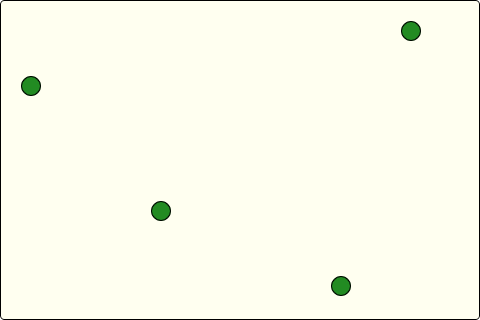
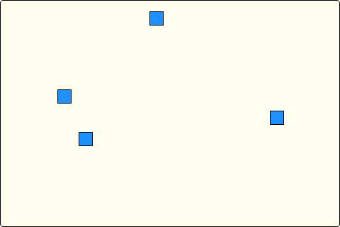
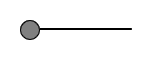
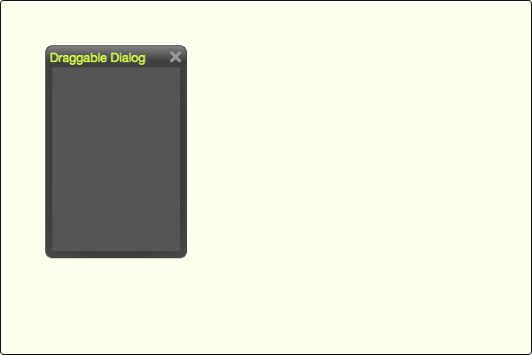

# dommali-utils #

various utility functions for DOMMaLi

`dommali-utils` extends the [dommali](https://github.com/rozek/dommali) library by several utility methods which implement various event handling functions, e.g., for element dragging or non-native drag-and-drop.

The idea behind `dommali-utils` is to give a programmer exactly that amount of control (s)he needs - and offer ready-made implementations for anything else. E.g., a typical usage may look as follows (see [JS Bin](https://jsbin.com/vihitaw) for a live demo):

```
   const $ = dommali
   $(() => {
     $(document.body).provideSimpleDraggingFor('.Dialog',{
       onlyFrom:'.Titlebar', neverFrom:'.CloseButton',
       rightLimit:30, bottomLimit:30
     })
   })
```

This snippet makes all `<div/>`s with the CSS class `Dialog` draggable from their titlebar. They may be dragged around within their whole parent but only so far that a small part of the titlebar always remains visible (and therefore accessible).

> Please note, that this module is currently under active development - do not expect a stable release before end of January 2023


## API ##

### Dragging Recognizer ###

`recognizeDragging` and `recognizeDraggingFor` install event handlers which listen for PointerEvents, recognize dragging gestures and trigger matching `dragging-started`, `dragging-continued`, `dragging-finished` and `dragging-aborted` events. These may then be listened for in order to implement the actual element dragging (see corresponding examples in the Programming Manual).

Dragging recognizers support the following `DraggingOptions` - all of them are optional:

* **`onlyFrom:string`**<br>if given, only PointerEvents originating from an inner element matching the CSS selector `onlyFrom` will be considered, all others will be ignored. `onlyFrom` may be combined with `neverFrom`
* **`neverFrom:string`**<br>if given, PointerEvents originating from an inner element matching the CSS selector `neverFrom` will be ignored. `neverFrom` may be combined with `onlyFrom`
* **`initialDirection:DraggingDirection`**<br>may be set to `x`, `y` or `both`. When set to `x` or `y`, dragging will only be started if the pointer has moved in the given direction at the moment dragging will be recognized (as given by `minOffsetX` and `minOffsetY`) - otherwise dragging will be ignored
* **`minOffsetX:number`**<br>if set to 0, dragging immediately starts with the initial `pointerdown` event. When set to a value > 0, `dragging-started` will be delayed until the pointer has moved at least `minOffsetX` or `minOffsetY` pixels from the point reported by `pointerdown` (whatever comes first)
* **`minOffsetY:number`**<br>if set to 0, dragging immediately starts with the initial `pointerdown` event. When set to a value > 0, `dragging-started` will be delayed until the pointer has moved at least `minOffsetX` or `minOffsetY` pixels from the point reported by `pointerdown` (whatever comes first)
* **`Easing:number|boolean`**<br>if set to a value between 0 and 1 (exclusively), dragged elements are given some "moment of inertia". This means that dragged elements with a velocity > 0 at the moment of a `pointerup` event will continue to move in their last direction (and trigger `dragging-continued` events) until (simulated) "friction" stops them. The extra events will be triggered every 100ms, and from one event to the next the dragged object's velocity (measured in pixels per second) will be multiplied with the given `Easing` factor until it falls below 10px/s. `dragging-finished` will only be triggered after the dragged elements have stopped moving
* **`stopPropagation:boolean`**<br>if set to `true`, further propagation of intercepted PointerEvents will be stopped - otherwise they may "bubble" as usual
* **`stopImmediatePropagation:boolean`**<br>if set to `true`, further handling and propagation of intercepted PointerEvents will be stopped
* **`Extras:any`**<br>is an optional, user-defined value which is passed unmodified along any `dragging-xxx` event and may be used to differentiate between kinds of dragging within the same event handler

#### Element-specific Recognizer ####

The following methods may be applied to `dommali` objects which shall become "draggable" in their own specific way.

At most one specific recognizer may be installed per `dommali` object.

* **`recognizesDragging ():boolean`**<br>returns `true` if a specific dragging recognizer is currently installed in `this` dommali object - of `false` otherwise
* **`recognizeDragging (Options?:DraggingOptions):DOMMaLi`**<br>installs a specific dragging recognizer with the (optionally) given `Options` in `this` dommali object (see above for a description of available `DraggingOptions`). If there is already a specific recognizer installed in `this` object, it is implicitly uninstalled before installing the new one (using `ignoreDragging`)
* **`ignoreDragging ():DOMMaLi`**<br>uninstalls the currently installed specific dragging recognizer from `this` dommali object - it is ok to call `ignoreDragging` even if such a recognizer is actually missing

#### Delegated Recognizer ####

The following methods use delegated event handlers for dragging recognition. They detect dragging gestures for any element matching a given `Selector` and trigger corresponding events at the `dommali` objects the methods have been applied to. Delegated event handlers reduce the implementation effort if multiple elements should be treated in a similar way.

Multiple delegated recognizers with different selectors may be installed in the same `dommali` object - but at most one per selector.

* **`recognizesDraggingFor (Selector:string):boolean`**<br>returns `true` if a delegated dragging recognizer for elements matching the given `Selector` is currently installed in `this` dommali object - of `false` otherwise
* **`recognizeDraggingFor (Selector:string, Options?:DraggingOptions):DOMMaLi`**<br>installs a delegated dragging recognizer with the (optionally) given `Options` for elements matching the given `Selector` in `this` dommali object (see above for a description of available `DraggingOptions`). If there is already a recognizer with the same `Selector` installed in `this` object, it is implicitly uninstalled before installing the new one (using `ignoreDraggingFor(Selector)`)
* **`ignoreDraggingFor (Selector:string):DOMMaLi`**<br>uninstalls the currently installed delegated dragging recognizer for elements matching the given `Selector` from `this` dommali object - it is ok to call `ignoreDraggingFor` even if such a recognizer is actually missing

### Simple Dragging ###

Based on the "Dragging Recognizers" described above, `provideSimpleDragging` and `provideSimpleDraggingFor` offer directly usable implementations for elements which may be dragged around within their parents.

These implementations may be customized using the following `simpleDraggingOptions` which extend the `DraggingOptions` already mentioned above - again, all settings are optional:

* **`leftLimit:number`**<br>if specified, `leftLimit` keeps the left edge of a dragged element the given number of pixels away from the left edge of its parent (in the same way as the CSS property `left` positions a DOM element within its offset parent)
* **`topLimit:number`**<br>if specified, `topLimit` keeps the top edge of a dragged element the given number of pixels away from the top edge of its parent (in the same way as the CSS property `top` positions a DOM element within its offset parent)
* **`rightLimit:number`**<br>if specified, `rightLimit` keeps the left edge of a dragged element the given number of pixels away from the right edge of its parent (in the same way as the CSS property `right` positions a DOM element within its offset parent)
* **`bottomLimit:number`**<br>if specified, `bottomLimit` keeps the top edge of a dragged element the given number of pixels away from the bottom edge of its parent (in the same way as the CSS property `bottom` positions a DOM element within its offset parent)

If `provideSimpleDragging` or `provideSimpleDraggingFor` are applied without previously installing a corresponding dragging recognizer, such a recognizer is implicitly installed using the given options.

#### Element-specific Dragging ####

* **`provideSimpleDragging (Options?:simpleDraggingOptions):void`**<br>

#### Delegated Dragging ####

* **`provideSimpleDraggingFor (Selector:string, Options?:simpleDraggingOptions):void`**<br>


## Programming Manual ##

### Continuous Dragging ###



The first example (see [JSBin](https://jsbin.com/miwomis) for a live demo) illustrates how to install a dragging recognizer in a `<div/>` called `#Arena` (in order to make all inner elements with CSS class `Circle` draggable) and then to listen for `dragging-xxx` events in order to implement the actual dragging. The example does not offer much functionality but may be used as a starting point for more complex implementations (as shown in the next example).

Please note the use of function and fat-arrow literals depending on the intended use of the current `this` object.

```
$('#Arena').recognizeDraggingFor('.Circle', { minOffsetX:4, minOffsetY:4 })
$('#Arena').on('dragging-started', '.Circle', async function (
  Event, Extras, curX,curY, StartX,StartY
) {
  let $Draggable = $(Event.target)
  let $Container = $Draggable.parent()

  let initialPosition = $Draggable.positionInParent()
  let OffsetX = initialPosition.left-StartX
  let OffsetY = initialPosition.top -StartY

  await this.repeatUntil('dragging-finished','dragging-aborted',async () => {
    $Draggable.css({ left:(curX+OffsetX)+'px', top:(curY+OffsetY)+'px' })

    Event = await this.waitFor('dragging-continued','dragging-finished','dragging-aborted')
    if (Event.type !== 'dragging-aborted') {
      [Extras,curX,curY] = $.extraParametersOfEvent(Event)
    }
  })

  if (Event.type === 'dragging-aborted') {
    $Draggable.css({ left:initialPosition.left+'px', top:initialPosition.top+'px' })
  }
})
```

### Rastered Dragging ###



The second example (see [JSBin](https://jsbin.com/kogades) for a live demo) illustrates how to add a custom feature to the plain dragging shown above. In this case, the top left position of draggable elements is simply restricted to the intersection points of a 20x20 grid:

```
 $('#Arena').recognizeDraggingFor('.Square', { minOffsetX:4, minOffsetY:4 })
 $('#Arena').on('dragging-started', '.Square', async function (
   Event, Extras, curX,curY, StartX,StartY
 ) {
   let $Draggable = $(Event.target)
   let $Container = $Draggable.parent()

   let initialPosition = $Draggable.positionInParent()
   let OffsetX = initialPosition.left-StartX
   let OffsetY = initialPosition.top -StartY

   await this.repeatUntil('dragging-finished','dragging-aborted',async () => {
     let x = 20*Math.round((curX+OffsetX)/20)
     let y = 20*Math.round((curY+OffsetY)/20)
     $Draggable.css({ left:x+'px', top:y+'px' })

     Event = await this.waitFor('dragging-continued','dragging-finished','dragging-aborted')
     if (Event.type !== 'dragging-aborted') {
       [Extras,curX,curY] = $.extraParametersOfEvent(Event)
     }
   })

   if (Event.type === 'dragging-aborted') {
     $Draggable.css({ left:initialPosition.left+'px', top:initialPosition.top+'px' })
   }
 })
```

### Continuous Slider ###



(see [JSBin](https://jsbin.com/junujug) for a live demo)

```
  const $ = dommali
  $(() => {
    $(document.body).recognizeDraggingFor('.Slider', { alwaysFrom:'.Slider-Knob' })
    $(document.body).on('dragging-started', '.Slider', async function (
      Event, Extras, curX,curY, StartX,StartY
    ) {
      let $Draggable = $(Event.target).find('.Slider-Knob')
      let $Container = $(Event.target)

      let initialPosition = $Draggable.positionInParent()
      let OffsetX = initialPosition.left-StartX

      await this.repeatUntil('dragging-finished','dragging-aborted',async () => {
        let x = Math.max(0,Math.min(curX+OffsetX,$Container.width()-20))
        $Draggable.css('left', x+'px')

        Event = await this.waitFor('dragging-continued','dragging-finished','dragging-aborted')
        if (Event.type !== 'dragging-aborted') {
          [Extras,curX,curY] = $.extraParametersOfEvent(Event)
        }
      })

      if (Event.type === 'dragging-aborted') {
        $Draggable.css({ left:initialPosition.left+'px', top:initialPosition.top+'px' })
      }
    })
  })
```

### Window Dragging ###



The following example (see [JSBin](https://jsbin.com/vihitaw) for a live demo) illustrates how to make all elements with the CSS class `Dialog` draggable within their parent (which should usually be the whole document body, but is restricted to a given `<div/>` in the live demo in order to show the `rightLimit` and `bottomLimit` options):

```
const $ = dommali
$(() => {
  $(document.body).provideSimpleDraggingFor('.Dialog',{
    onlyFrom:'.Titlebar', neverFrom:'.CloseButton',
    rightLimit:30, bottomLimit:30
  })
})
```


## Build Instructions ##

You may easily build this package yourself.

Just install [NPM](https://docs.npmjs.com/) according to the instructions for your platform and follow these steps:

1. either clone this repository using [git](https://git-scm.com/) or [download a ZIP archive](https://github.com/rozek/dommali-utils/archive/refs/heads/main.zip) with its contents to your disk and unpack it there 
2. open a shell and navigate to the root directory of this repository
3. run `npm install` in order to install the complete build environment
4. execute `npm run build` to create a new build

You may also look into the author's [build-configuration-study](https://github.com/rozek/build-configuration-study) for a general description of his build environment.

## License ##

[MIT License](LICENSE.md)
